# 아재개그 퀴즈 게임

Codyssey Mission 2 — Python과 Git으로 만드는 나만의 콘솔 프로그램

## 1. 프로젝트 개요

터미널에서 실행되는 퀴즈 게임입니다. 문제를 풀고, 새 문제를 추가하고, 점수를 확인할 수 있습니다.
프로그램을 껐다 켜도 추가한 문제와 최고 점수가 그대로 유지됩니다 (state.json 파일에 저장).

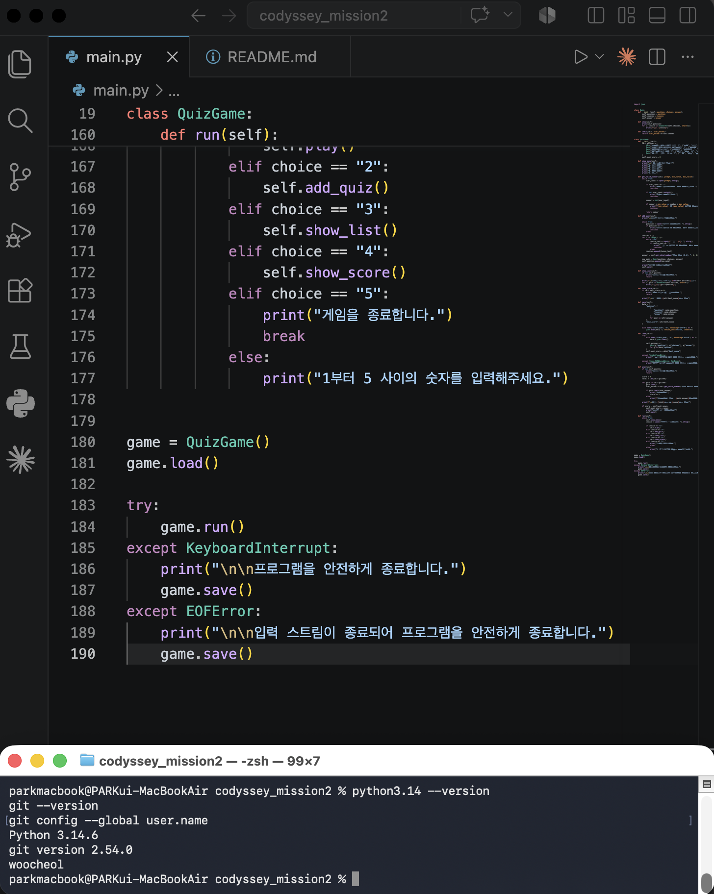

## 2. 퀴즈 주제와 선정 이유

주제는 아재개그로 정했습니다. 부담 없이 재밌게 즐길 수 있는 주제라서 골랐습니다.

## 3. 실행 방법

```bash
python3.14 main.py
```

Python 3.10 이상이 필요합니다. (이 프로젝트는 3.14 버전으로 개발했습니다.)

## 4. 기능 목록

- **퀴즈 풀기**: 등록된 모든 문제를 순서대로 풀고, 마지막에 점수를 보여줍니다.
- **퀴즈 추가**: 새 문제, 선택지 4개, 정답을 입력해서 등록합니다.
- **퀴즈 목록**: 지금까지 등록된 문제 목록을 번호와 함께 보여줍니다.
- **점수 확인**: 지금까지의 최고 점수를 보여줍니다.
- **종료**: 프로그램을 안전하게 끝냅니다. Ctrl+C로 강제 종료해도 데이터는 저장됩니다.

## 5. 파일 구조

```
codyssey_mission2/
├── main.py          (전체 코드: Quiz, QuizGame 클래스)
├── state.json       (저장된 퀴즈와 점수, 자동 생성됨)
├── README.md
└── .gitignore
```

## 6. 데이터 파일 설명 (state.json)

퀴즈 데이터와 최고 점수를 저장하는 파일입니다. 프로젝트 폴더 바로 아래에 생기고, UTF-8로 인코딩됩니다.

```json
{
  "quizzes": [
    {
      "question": "문제 내용",
      "choices": ["선택지1", "선택지2", "선택지3", "선택지4"],
      "answer": 1
    }
  ],
  "best_score": 3
}
```

- quizzes: 등록된 퀴즈 목록. 각 퀴즈는 문제(question), 선택지 4개(choices), 정답 번호(answer)를 가집니다.
- best_score: 지금까지의 최고 점수(맞힌 문제 수)입니다.

파일이 없으면 기본 퀴즈 5개로 시작하고, 파일이 손상되어 있으면 안내 메시지를 보여준 뒤 역시 기본 퀴즈로 시작합니다.

## 7. 개발 과정 (스크린샷)

### 7.1 프로젝트 설정

```bash
pwd
python3.14 --version
```

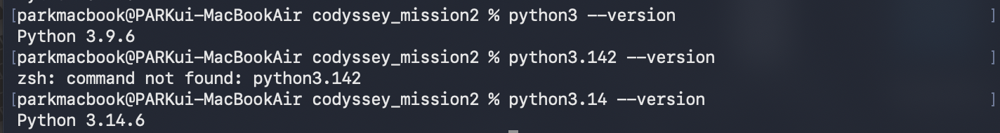

```bash
git clone https://github.com/3043382-svg/codyssey_mission2.git
```

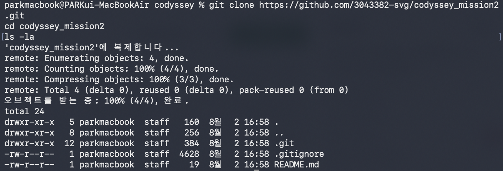

첫 실행 확인:

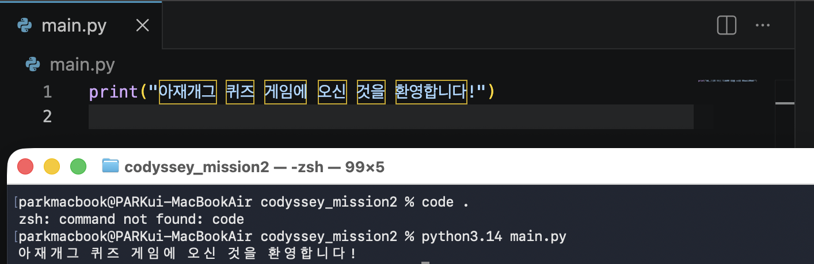

### 7.2 Quiz 클래스 — 퀴즈 하나를 표현하는 설계도

```python
class Quiz:
    def __init__(self, question, choices, answer):
        ...
```

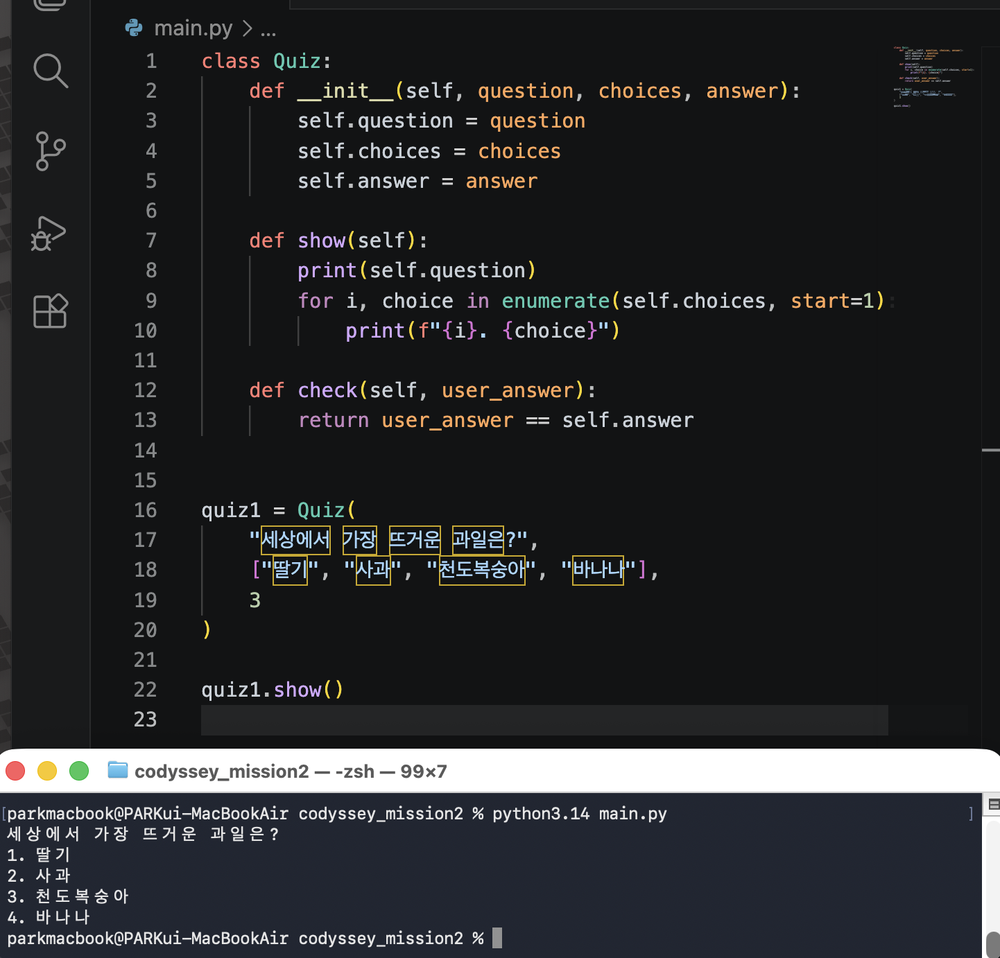

입력값 검증(공백 제거, 숫자 확인, 범위 확인, 빈 입력 처리):

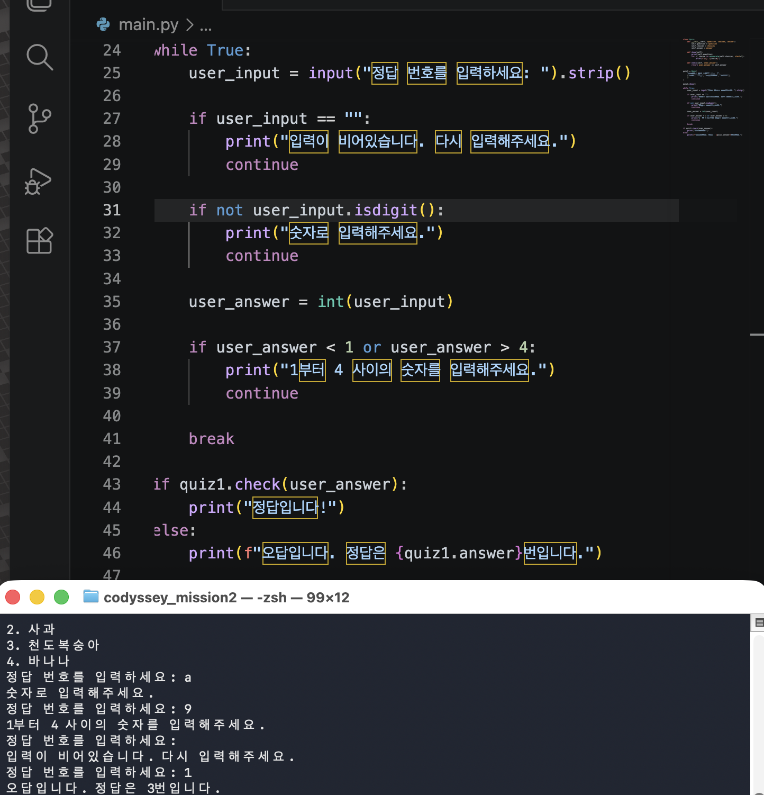

### 7.3 QuizGame 클래스 — 메뉴와 전체 진행 관리

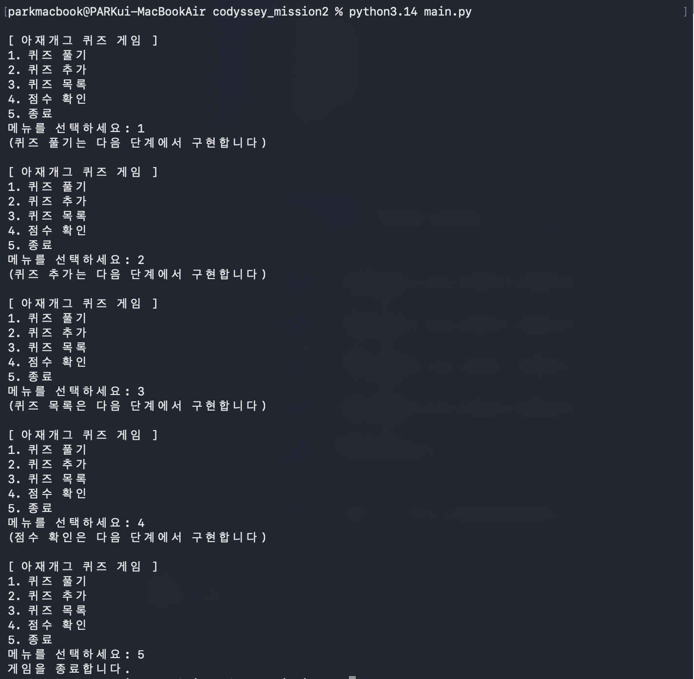

퀴즈 5개를 채우고 "퀴즈 풀기" 기능 완성:

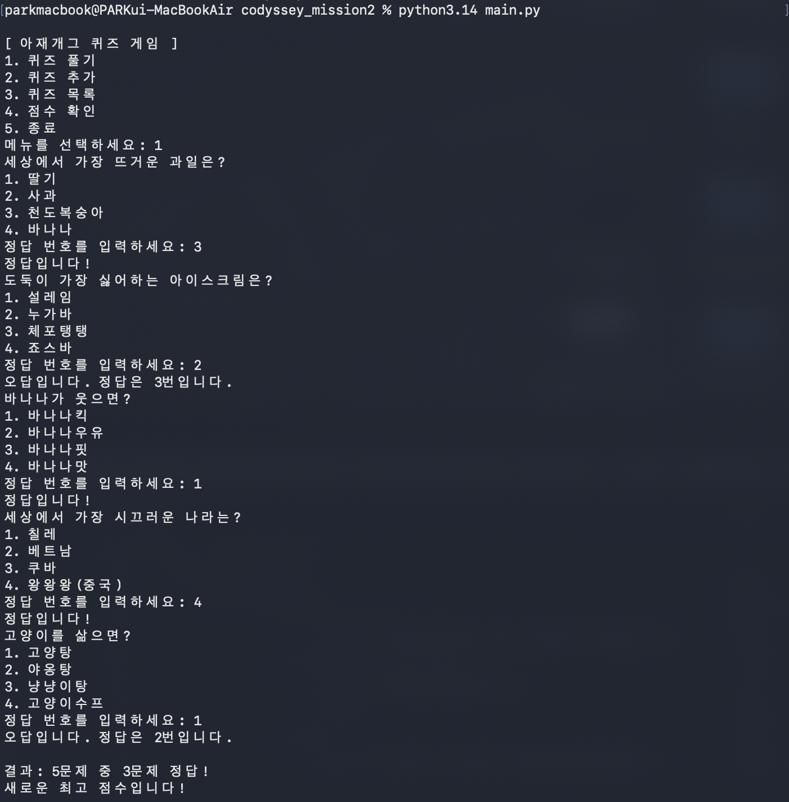

"퀴즈 추가" 기능 완성:

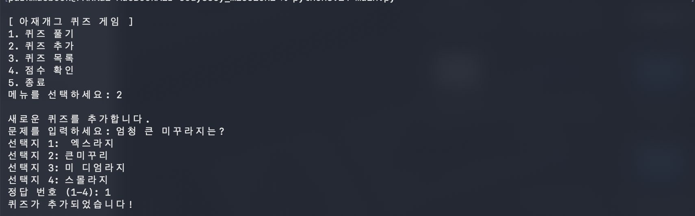

"퀴즈 목록"과 "점수 확인" 기능 완성:

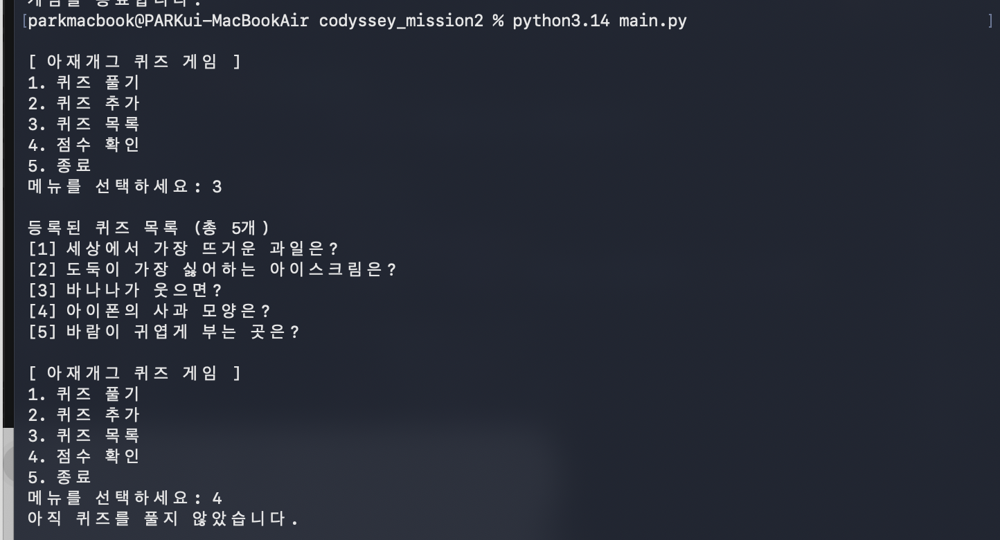
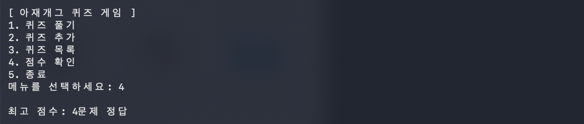

### 7.4 데이터 영속성 — state.json 저장/불러오기

프로그램을 종료 후 재실행해도 추가한 퀴즈와 점수가 유지됩니다.

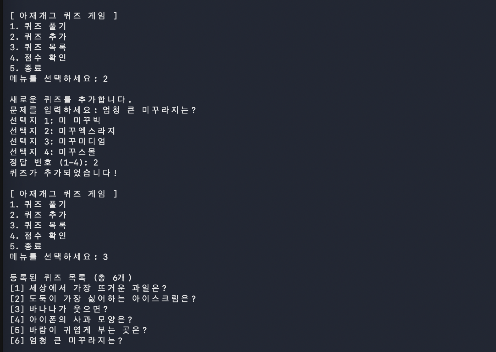

### 7.5 Git 워크플로우

여기까지의 작업을 뒤늦게 한 번에 커밋한 기록:

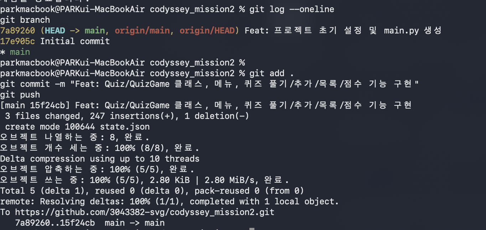

`feature/exit-handling` 브랜치를 만들어 Ctrl+C 안전 종료 처리를 작업하고, main으로 병합:

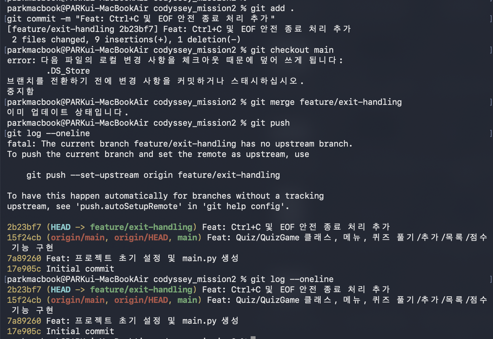

Ctrl+C를 눌러도 안전하게 종료되는지 확인:

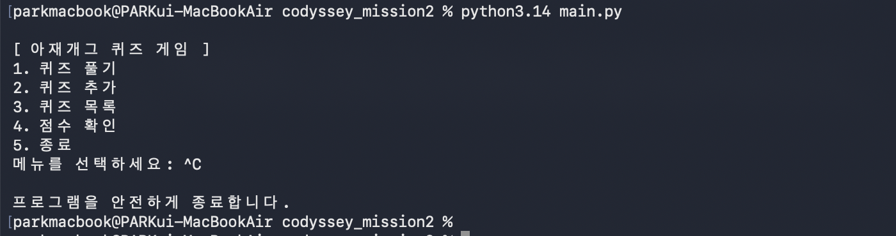

### 7.6 clone / pull 실습

별도 폴더(codyssey_mission2_clone)에 저장소를 다시 clone하고, README를 수정한 뒤 push:

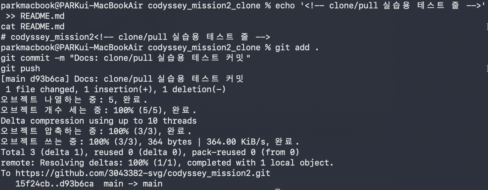

원래 작업 폴더에서 pull로 그 변경사항을 가져옴:

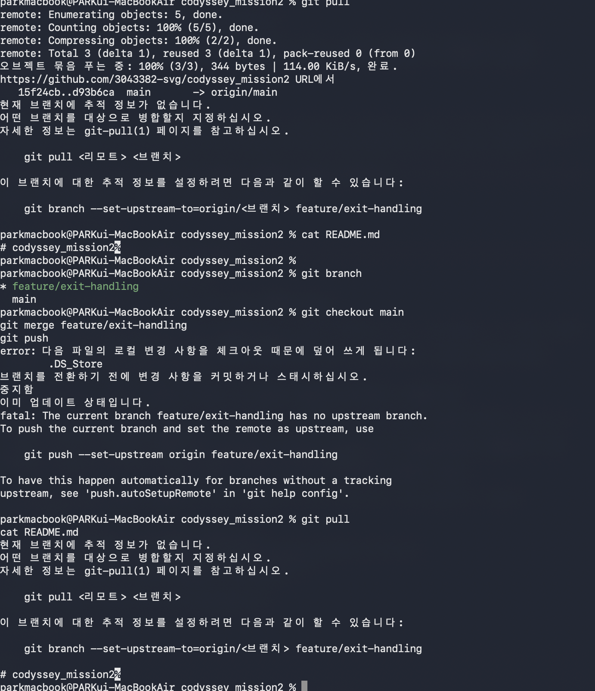

### 7.7 최종 커밋 히스토리

```bash
git log --oneline --graph
```

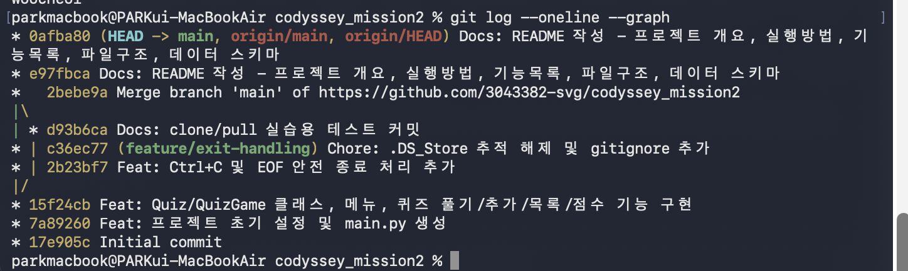
